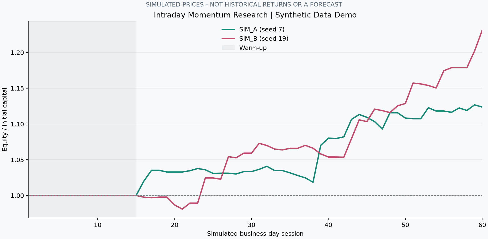
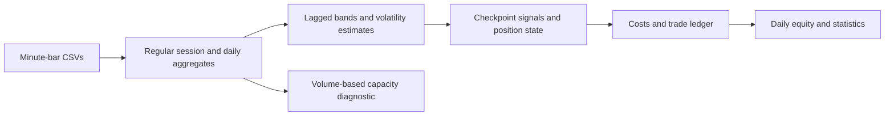

# Intraday Momentum Research

A Python research project for comparing an intraday momentum strategy on SPY and
QQQ minute bars. It combines volatility-based breakout bands, VWAP exits,
volatility-targeted position sizing, transaction costs, and a volume-based
capacity diagnostic.

The repository includes a reproducible offline demo, trade and equity exports,
and tests for signal timing and accounting. It is a research prototype; the
included demonstration uses simulated prices, not historical market returns.



## Quick Start

Requires Python 3.10 or newer. Clone or download this repository, open its folder,
and create a virtual environment:

```sh
python -m venv .venv
```

Activate it using `.venv\Scripts\Activate.ps1` in PowerShell or
`source .venv/bin/activate` on macOS/Linux. Then:

```sh
python -m pip install -r requirements.txt
python demo.py
python -m unittest discover -s tests -v
```

The demo creates two deterministic synthetic instruments, runs the actual
backtester, and writes its inputs, trade logs, daily equity, metrics, capacity
tables, and an equity chart to `outputs/demo/`. No API key or brokerage connection
is used. Synthetic business days do not model exchange holidays.

## What It Implements

- Minute-bar OHLCV ingestion with regular-session filtering.
- Historical intraday noise bands using a lagged rolling lookback.
- Long and short breakout entries at half-hour checkpoints.
- VWAP/band-based exits and end-of-session liquidation.
- Volatility targeting with a configurable leverage cap.
- Entry and exit commissions and fixed per-share slippage.
- Daily returns, drawdown, Sharpe-style statistics, and trade-level P&L exports.
- Capacity diagnostics using 30-bar dollar volume and hypothetical full reversals.
- Optional IBKR and Alpaca historical-data downloaders with local caching.

## Strategy Logic

For each clock minute, the model calculates the average absolute move from that
day's open over the previous 14 sessions. Today's observation is excluded from
that rolling estimate. The upper band is based on the greater of today's open
and the prior close; the lower band uses the smaller of the two.

At 10:00, 10:30, ..., 15:30 New York time, a close above the upper band can trigger
a long position; a close below the lower band can trigger a short. Longs exit
when the close falls to or below the greater of the upper band and current VWAP.
Shorts use the corresponding lower-band/VWAP rule. Positions are closed at the
configured close time or the final available bar.

Position size uses the prior daily-return volatility, a 2% target daily
volatility, and a default 4x leverage cap. Share count is based on the session
open and start-of-day equity, so actual leverage can differ at the entry price.
Defaults are research assumptions, not suggested trading settings.

## Bring Your Own Data

Provide `<TICKER>_1min.csv` files with these columns:

```text
datetime,open,high,low,close,volume
```

Naive timestamps are interpreted as New York local time. Use the supplied
normalizer for provider timestamps. Input data should have unique timestamps,
positive prices, and consistent split/dividend adjustments.

```sh
python intraday_momentum_compare_clean.py --data-dir data --tickers SPY QQQ
```

The script writes `<TICKER>_daily_results.csv`, `<TICKER>_trades.csv`,
`strategy_comparison_summary.csv`, and `capacity_estimate.csv` alongside the
input files. Tune research parameters through the `Params` dataclass:

```python
from pathlib import Path
from intraday_momentum_compare_clean import Params, load_minute_csv, backtest_one_ticker

bars = load_minute_csv(Path("data/SPY_1min.csv"))
params = Params(lookback_days=14, max_leverage=2.0)
daily, trades, metrics = backtest_one_ticker(bars, "SPY", params)
```

## Optional Market Data

The downloader supports IBKR through `ib_async` and Alpaca through HTTP. It does
not submit orders. Data access depends on your provider account and entitlements;
the live integrations are not exercised by the offline tests.

For IBKR, install `requirements-ibkr.txt` and connect your configured TWS/Gateway:

```sh
python fetch_minute_bars.py --provider ibkr --symbols SPY QQQ --data-dir data --start 2024-01-01 --end 2024-02-01
```

For Alpaca, set `APCA_API_KEY_ID` and `APCA_API_SECRET_KEY` in your environment:

```sh
python fetch_minute_bars.py --provider alpaca --symbols SPY QQQ --data-dir data --start 2024-01-01 --end 2024-02-01
```

Run `python fetch_minute_bars.py --help` for connection, feed, and chunking options.
Downloaded market data, credentials, and local account configuration are excluded
from the repository. Obtain your own data under your provider's terms.

## Architecture



| File | Purpose |
| --- | --- |
| `intraday_momentum_compare_clean.py` | Feature construction, execution simulation, reporting, capacity calculations. |
| `fetch_minute_bars.py` | Provider normalization, caching, IBKR/Alpaca download paths. |
| `demo.py` | Seeded synthetic data and a reproducible end-to-end run. |
| `tests/test_backtest.py` | Accounting, signal-history, no-trade, and data-normalization regression tests. |
| `.github/workflows/ci.yml` | Automated offline tests on Linux and Windows. |

## Research Limitations

- Orders are simulated at the same bar close used to calculate the signal.
  Executable next-bar prices, latency, spread, queue position, and partial fills
  are not modeled. Results are not evidence of a deployable trading edge.
- The daily band and volatility estimates are lagged, but this alone does not
  eliminate all backtest bias. There is no out-of-sample tuning or walk-forward
  evaluation in this version.
- Per-share costs are fixed assumptions. Financing, borrow fees, corporate-action
  effects, taxes, and nonlinear market impact are omitted.
- Equity is reported daily; drawdown is close-to-close, not intraday. Summary
  statistics include warm-up days with zero strategy return, annualize at 252
  sessions, and use a zero risk-free rate for Sharpe.
- The last available bar stands in for a session close. Missing bars, exchange
  holidays, early closes, duplicate timestamps, and bad prices require upstream
  validation before research use.
- Capacity is a participation-ratio diagnostic, not an execution model. Its legacy
  CSV column names say `4x`; formulas use `Params.max_leverage`. A 30-bar window can
  differ from 30 minutes if data is incomplete.

The public version corrects trade-level fee reporting so net trade P&L reconciles
with equity, records break-even trading days correctly, and includes initial
capital in the drawdown baseline. No historical performance claim is included.

See [portfolio and interview notes](docs/PORTFOLIO.md) for a concise project
description and the engineering decisions to discuss.
